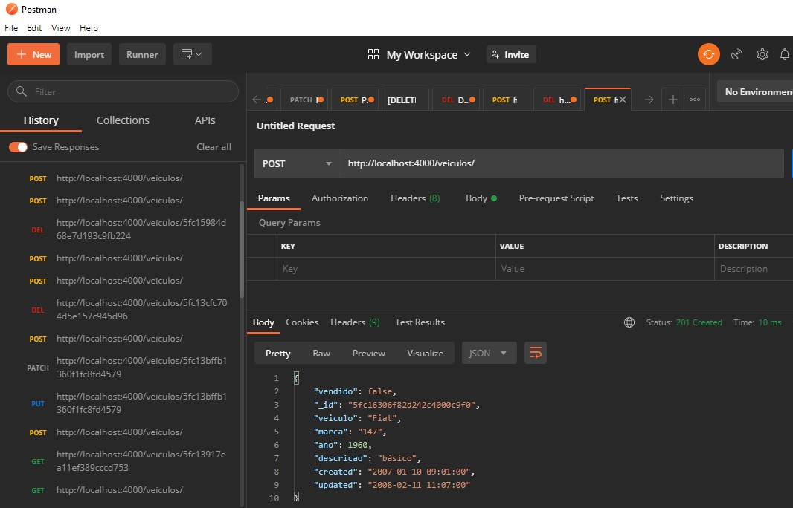

# Backend para questão 5

Atendendo parte dos requisitos, a saber:
- todos os verbos funcionando GET, POST, PUT, PATCH, DELETE (testados com o postman também)
- API endpoints foram implementados (com exceção de GET /veiculos/find)

Construído com Node.js + Express + MongoDB

## Screenshot

## Configuração
MongoDB - instale o MongoDB e importe alguns registros do arquivo [veiculos.json]

## Execução

Execute `npm start`, abra o navegador e digite `http://localhost:4000`. Você deverá ver a mensagem "api-veiculos funcionando".

Caso queira testar o front-end vá para o repositório [questao5-frontend](https://github.com/marcelosantosferreira/tn-questao5-frontend).

## Execução dos unit tests

Utilize `XXX`.
